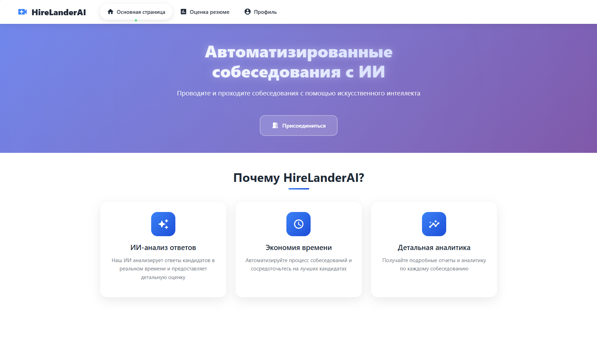
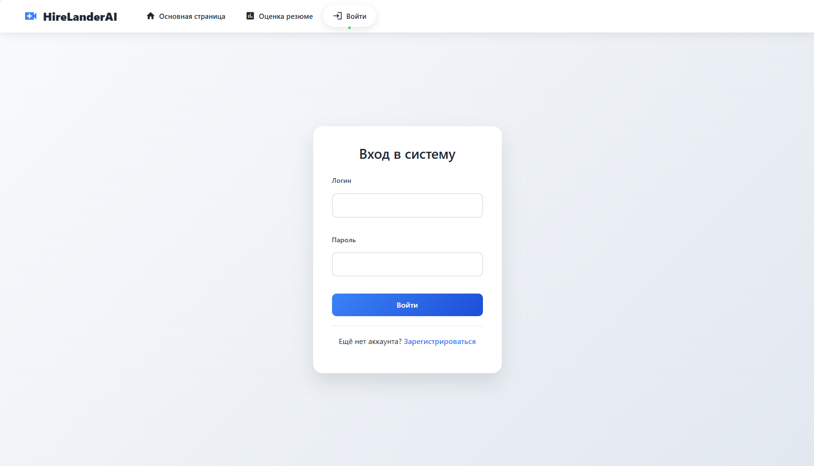
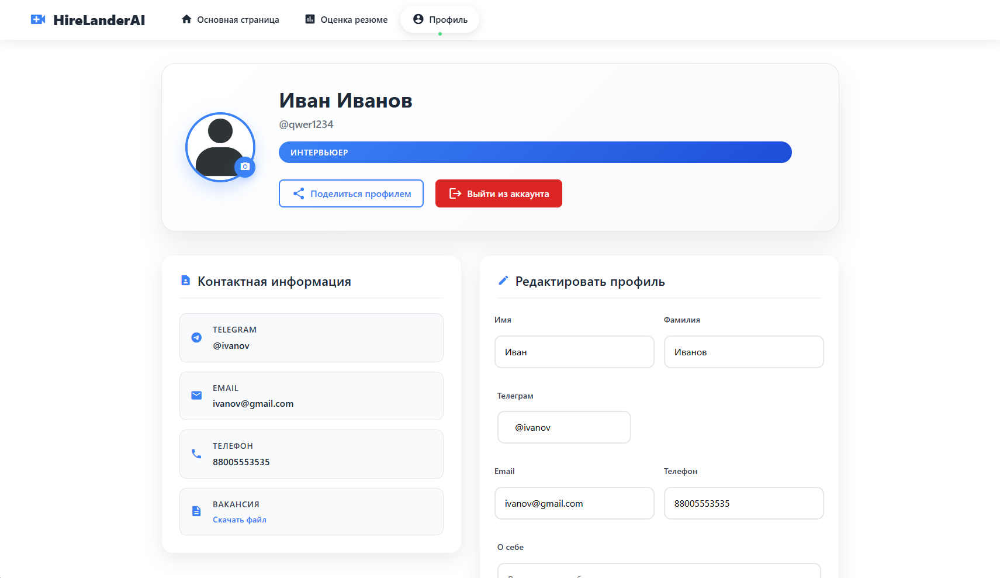
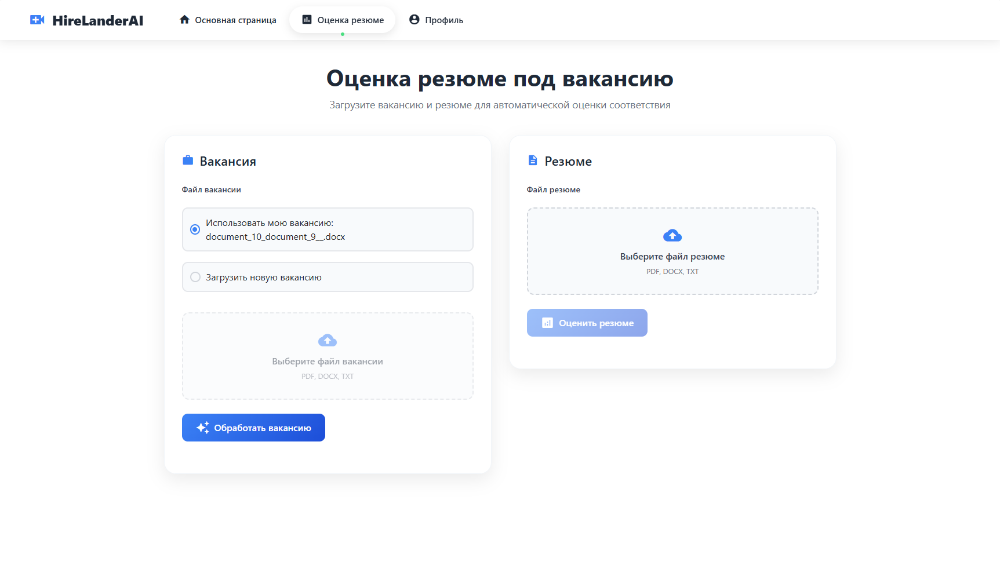
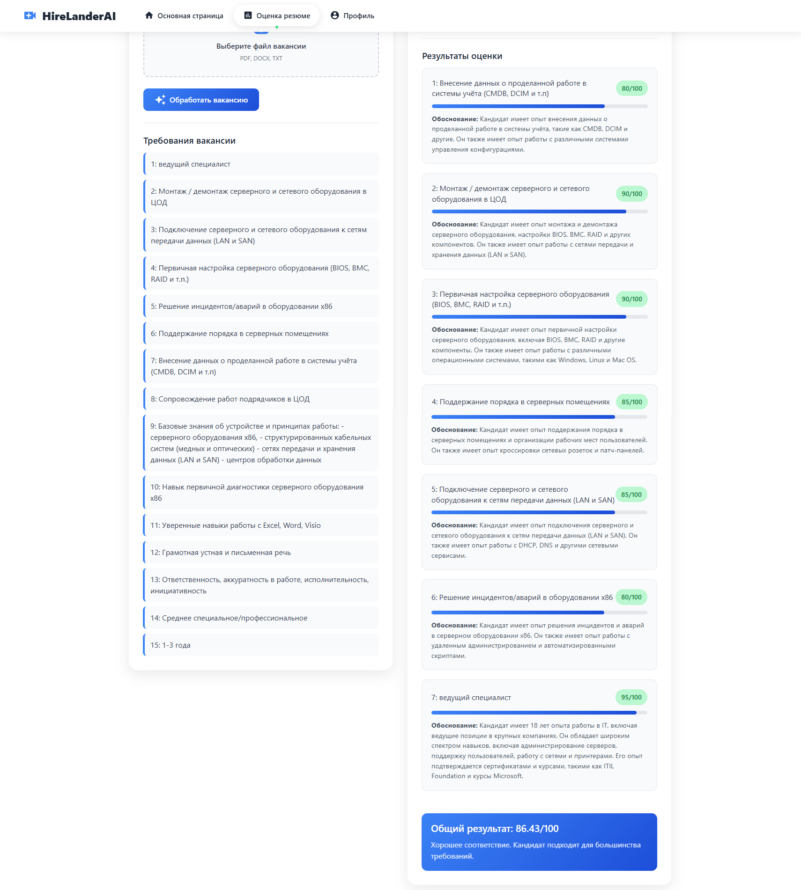
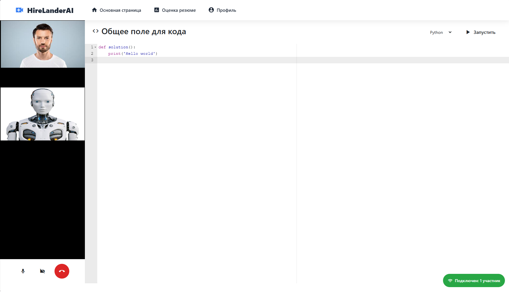

# HireLander AI

`HireLanderAI` is a system that can conduct an interview with a candidate by itself
and assess his or her suitability for the vacancy.

# Project objectives

Incorporating `HireLanderAI` into the hiring process could solve following problems:
* significant time spent on manual screening
* difficulty finding a convenient time for interviews
* decreased concentration of HR specialists and subjective errors in 
candidate assessments due to conducting numerous interviews throughout the day
* increased risk of missing strong candidates due to subjectivity

Although AI agents are not suited enough for full automation of such process,
they could at least help with some of the issues.

# Features

`HireLanderAI` comes with several features:
* vacancy/CV automatic screening and ranking
* AI that is able to speak, listen and read while conducting interview
* proctoring system

# Website interface

Main page:

Login page:

Profile page:

Screening page:

Coding page:

# Note

This project was developed as part of a hackathon in a short time frame and, as a result,
the written code is subject to technical debt and clogging.

However, the presented project is viable even in this state, and therefore may be an object of interest.
